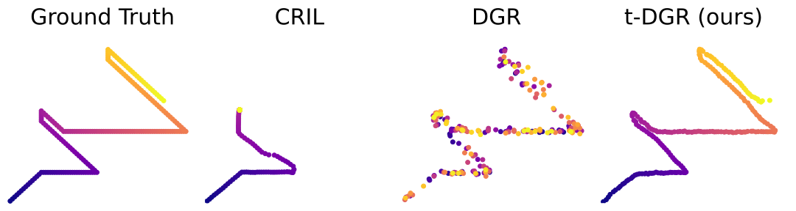

# t-DGR
A trajectory-based Deep Generative Replay method for lifelong learning in decision making tasks.




# Installtion
Download [mujoco210](https://github.com/openai/mujoco-py) and then run the following commands:
```shell
conda env create -f environment.yml
conda activate t-dgr
pip install -r requirements.txt
```

# Getting Started

See the `scripts/` folder for examples of how to train and evaluate methods. For example, to train t-DGR, run the following command:

```shell
./scripts/run_t-dgr.sh
```

# Training
To train a model, run the following command:

```shell
python methods/<method_name>/train_<method_name>.py [--options]
```

To see the full list of options, run `python methods/<method_name>/train_<method_name>.py --help`.

Learner model checkpoints at the end of each task are saved to `run/<ckpt-folder>/learner_ckpts/`.

# Evaluation

To evaluate a model, run the following command:

```shell
python methods/<method_name>/test.py [--options]
```

To see the full list of options, run `python methods/<method_name>/test.py --help`.

# Datasets

The Continual World and GCL10 datasets used in the paper are located in `datasets/continual_world/` and `datasets/GCL10/`, respectively. The script used to generate expert demonstrations is included in `datasets/collect_data.py`. To collect expert demonstrations, run the following command:

```shell
python datasets/collect_data.py [--options]
```

To see the full list of options, run `python datasets/collect_data.py --help`.

# Citation
If you find **t-DGR** to be useful in your own research, please consider citing our paper: